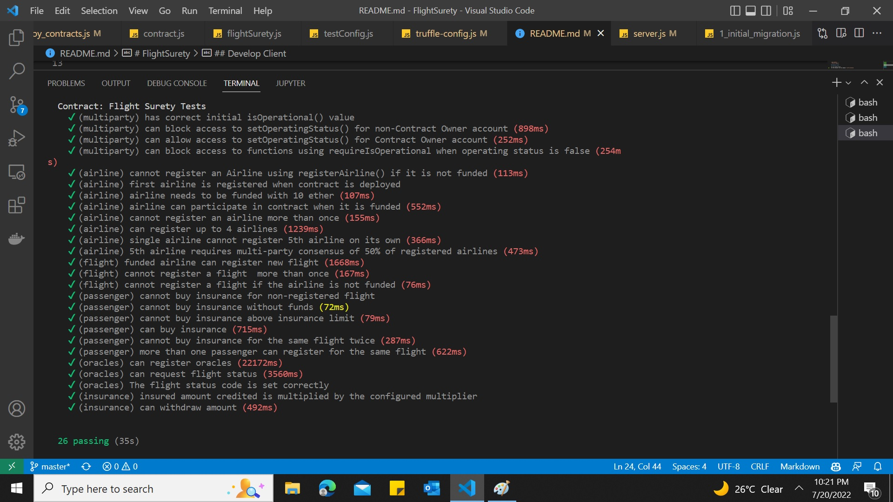
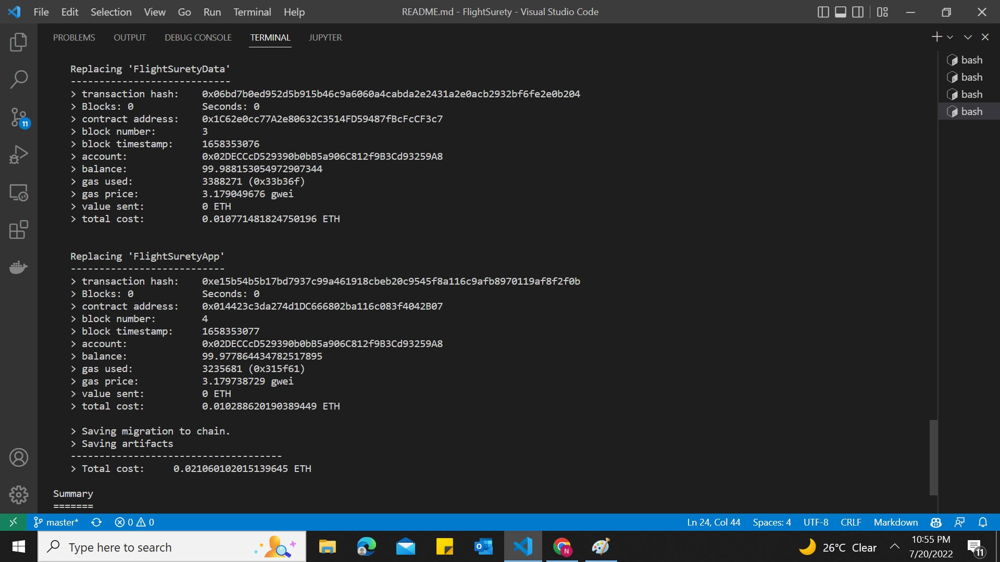
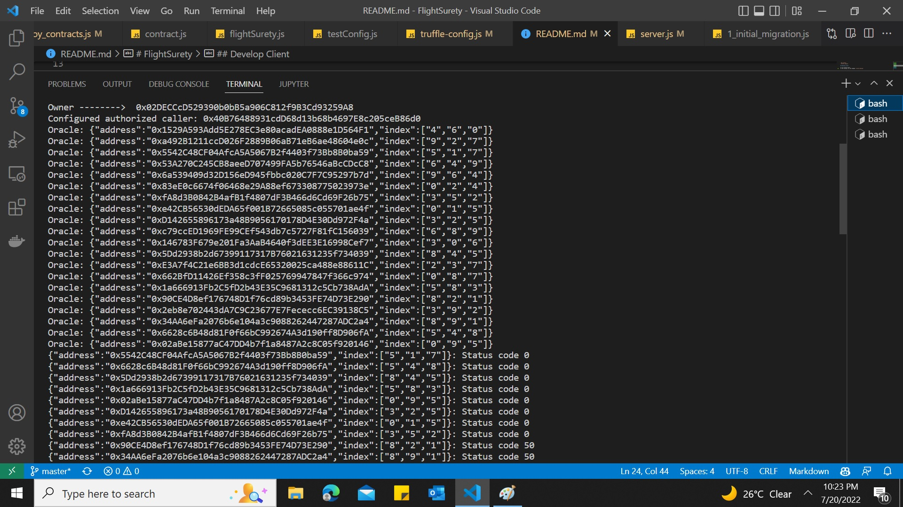

# FlightSurety

FlightSurety is a sample application project for Udacity's Blockchain course.

## Install

This repository contains Smart Contract code in Solidity (using Truffle), tests (also using Truffle), dApp scaffolding (using HTML, CSS and JS) and server app scaffolding.

To install, download or clone the repo, then:

`npm install`
`truffle compile`

## Develop Client

To run truffle tests:
In the terminal run the command `truffle develop`

Then run the command `test`

To use the dapp:
Open a terminal and run `truffle develop` then enter the command `migrate --reset`

In another terminal run `npm run dapp:prod`

To view dapp:

Open the `index.html` file in the `prod/dapp` folder in a browser.

## Develop Server

`npm run server`

`truffle test ./test/oracles.js`

## Deploy

To build dapp for prod:
`npm run dapp:prod`

Deploy the contents of the ./dapp folder

## Resources

* [How does Ethereum work anyway?](https://medium.com/@preethikasireddy/how-does-ethereum-work-anyway-22d1df506369)
* [BIP39 Mnemonic Generator](https://iancoleman.io/bip39/)
* [Truffle Framework](http://truffleframework.com/)
* [Ganache Local Blockchain](http://truffleframework.com/ganache/)
* [Remix Solidity IDE](https://remix.ethereum.org/)
* [Solidity Language Reference](http://solidity.readthedocs.io/en/v0.4.24/)
* [Ethereum Blockchain Explorer](https://etherscan.io/)
* [Web3Js Reference](https://github.com/ethereum/wiki/wiki/JavaScript-API)

## Versions

* Truffle v5.5.12 (core: 5.5.12)
* Ganache v^7.1.0
* Solidity - 0.8.14 (solc-js)
* Node v16.14.2
* Web3.js v1.5.3
